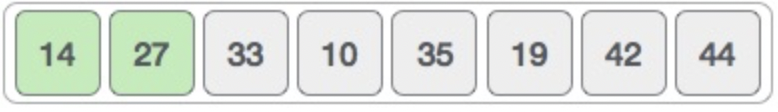

# Data-Structure-and-Algorithms-Insertion-Sort

This is an in-place comparison-based sorting algorithm. Here, a sub-list is maintained which is always sorted. For example, the lower part of an array is maintained to be sorted. An element which is to be 'insert'ed in this sorted sub-list, has to find its appropriate place and then it has to be inserted there. Hence the name, insertion sort.

The array is searched sequentially and unsorted items are moved and inserted into the sorted sub-list (in the same array). This algorithm is not suitable for large data sets as its average and worst case complexity are of Ο(n2), where n is the number of items.

## How Insertion Sort Works?

We take an unsorted array for our example.

Insertion sort compares the first two elements.

It finds that both 14 and 33 are already in ascending order. For now, 14 is in sorted sub-list.

Insertion sort moves ahead and compares 33 with 27.

And finds that 33 is not in the correct position.

It swaps 33 with 27. It also checks with all the elements of sorted sub-list. Here we see that the sorted sub-list has only one element 14, and 27 is greater than 14. Hence, the sorted sub-list remains sorted after swapping.

By now we have 14 and 27 in the sorted sub-list. Next, it compares 33 with 10.

These values are not in a sorted order.

So we swap them.

However, swapping makes 27 and 10 unsorted.

Hence, we swap them too.

Again we find 14 and 10 in an unsorted order.

We swap them again. By the end of third iteration, we have a sorted sub-list of 4 items.

This process goes on until all the unsorted values are covered in a sorted sub-list. Now we shall see some programming aspects of insertion sort.

## Algorithm

Now we have a bigger picture of how this sorting technique works, so we can derive simple steps by which we can achieve insertion sort.

## Pseudocode

